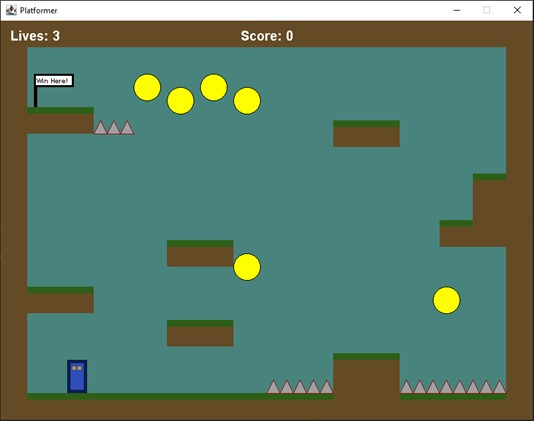
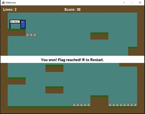
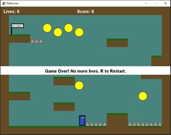

# 1.1 Platformer Game Clone Overview

**Overview written by Peter Mitchell.**

## Contents

```
1.1 Platformer Game Clone Overview
1.2 Introduction
1.3 The Rules of Platformer
1.4 High Level Discussion About Implementation
1.5 How the Core Game Works
1.6 Features You Could Add
```
# 1.2 Introduction

This document will explain the fundamentals of how the Platformer game works. 

# 1.3 The Rules of Platformer

The rules implemented for this platformer can be summarised by the following list.

- The player is controlled by using left/right arrows and space to jump. The player conforms to
    a low gravity to fall down until it touches ground. The player can also double jump. The double
    jump is achieved by the first jump having to be in contact with the ground, and then while in
    the air they can perform a single second jump.
- The game consists of different types of game objects. Some of these are inactive as part of the
    scene to act as ground including a brown block, and a grass block.
- Interactable elements include spikes that cause instant death on collision with the player,
    collectibles that increase score on collision with the player, and a victory flag that signals the
    level has been won.
- The player starts with three lives and if they die three times, they will get a game over screen.
- Each time a player dies they will restart with the map in its default state and no score.
- At any time, the player can exit the game with escape, or restart (with 3 lives) by pressing R.


# 1.4 High Level Discussion About Implementation

Below you can see the initial state of the game. The player is in the bottom left, the spikes seen in the
bottom right and near the flag at the top are lethal, the yellow circles are collectibles with 5 score
each. And the flag at the top left wins the game. The player is controlled with left/right arrows, and
space to jump. You can double jump by jumping once on the ground and a second time in the air.
Other controls include R to restart and Escape to quit.



Below are examples of triggering the two different end game conditions. One where the game has
been won with collecting all the available score on the left. And on the right where the player has used
up all their lives and triggered a game over with losing it. You can see the eyes on the character move
left/right depending on the direction of motion compared to the above where the character is
stationary and looking forward.

 

# 1.5 How the Core Game Works

This section briefly covers the classes that have been included in this game. For the full details about
each class and to see how they all link together go and look at the individual files. They are fully
commented.

Generic classes:

- Position: represents an X and Y coordinate.
- Rectangle: represents a region of space with a position for the top left corner, a width, and a
    height.

Game interface and management classes:

- Game: Creates the JFrame and receives the keyboard input to propagate through the
    application.
- GamePanel: Manages the panel with the game is displayed by controlling all the game
    elements and updating the high-level game state.
- MapLoader: Loads maps from a text file by reading in their content and passing the created
    object into the ObjectManager.
- ObjectManager: Manages the collection of objects in the game that are loaded in as part of a
    map including all blocks, visual elements, interactable elements, and the player. This is stored
    as a collection of GameObjects.

Game element classes:

- GameObject: A generic object that extends Rectangle with a paint and update method to
    allow use for all types of game objects generically. Also includes states for whether the object
    acts as ground and if it can be moved through.
- CollisionTrigger: An interface that is used to provide a collideWith() method for any object
    that needs to handle a collision with the player.
- Collectible: A type of game object that can be collected once and then hides itself.
- Block: A generic block game object that acts as ground and is completely brown.
- GrassBlock: A slightly modified version of a Block that also has a green part at the top of the
    block to imitate grass.
- Player: The player character as a game object controls its own movement and physics while
    checking for collisions with other objects that use the CollisionTrigger.
- Spikes: A type of game object that causes death of the character when interacted with.
- VictoryFlag: A type of game object that triggers victory when reached.


# 1.6 Features You Could Add

The following list summarises some of the features you could try adding to change the game.

- Implement additional types of GameObjects. You could try adding different types of hazards,
    collectibles, or other elements that change how the scene works.
- Add additional maps and have a way to transition between them. At the moment the game
    just loads a single map file and does not transition to other maps. You can add as many maps
    as you want to increase the quality of the game.
- Try change the movement of the player and see how it changes the gameplay if you try using
    different levels of gravity and movement control.
- Add enemies and weapons to make the game challenging and more diverse.
- Implement a moving scene so you are not limited by just the space that is visually there at the
    beginning.
- Implement the first level of Mario.
- Try implementing enemies that can be jumped on top of to defeat them.
- Look at other types of platformers and try to implement features you find in them.
- Come up with your own unique platformer ideas and try to implement them.


